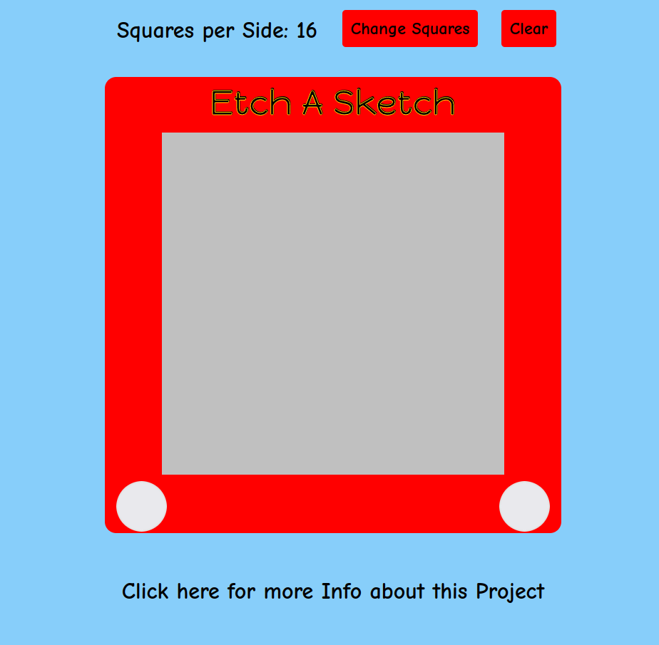

# Etch A Sketch Project

## Introduction

This [Etch A Sketch](https://mike-c2.github.io/odin-etch-a-sketch) was made as a project for [The Odin Project](https://www.theodinproject.com). For more information about the project requirements, see:

[Project: Etch-a-Sketch](https://www.theodinproject.com/lessons/foundations-etch-a-sketch)

 

## How to Play

Just move the mouse over the gray area to start drawing.  The default number of squares per side is 16 (the grid is 16 x 16).  This can be changed by clicking on the "Change Squares" button.  The Squares per Side has to be at least 1 and cannot be greater than 100, it must also be an integer.

You can also wipe the drawing area by clicking the "Clear" button.